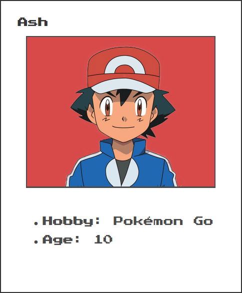
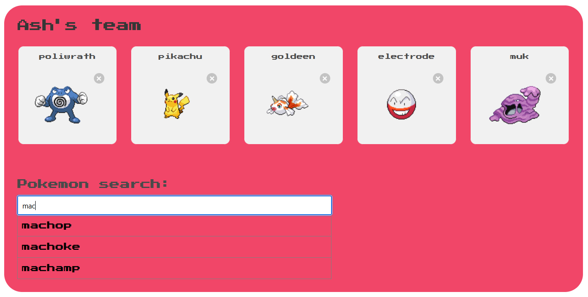
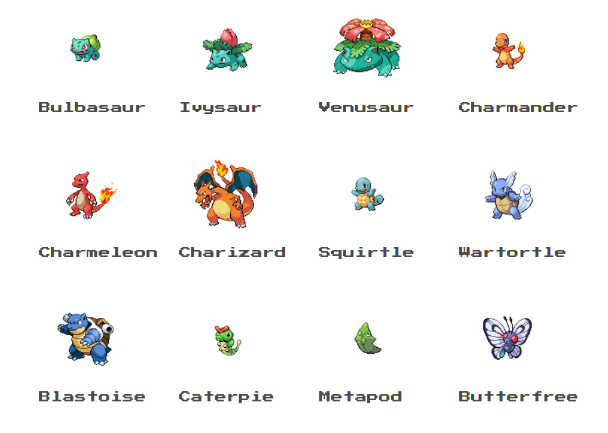

# Combiez Pokédex

_Angular and Spring Boot App / Ironhack 2021_

 
_The <b>Combiez Pokédex</b> is considered an invaluable tool for Trainers in the Pokémon World, providing you with all the information you need to make the most of your adventure in the legendary region of Kanto._  

## Instalation

1. Download this project from the repository.

2. Go to the back-end directory.

3. Run the back-end : `./mvnw spring-boot:run.`

4. Go to the front-end directory.

5. Run the front-end : `ng serve -o`

6. And the most important part... enjoy!

  
## Functionalities

### -> Are you a promising trainer from Pallet Town?

So, <b>congratulations!</b> All you need to start your path is to register in the <b>Trainers section</b>.

   

 Once you have <b>successfully registered</b>, you will be able to <b>create your own team</b> of up to 6 Pokémons.
 Do you already know with whom you want to share this adventure? Go to the <b>Team page</b> and search for them in the search bar. 
  _* Are you undecided? Do not feel pressured, you can change your mind at any time_

  

  
### -> What if I was just passing through?

If you are here we assume that it is because you are a <b>nostalgic fan</b> of the original version like us, so do not hesitate to visit our <b>Home page</b> _(to maximize the experience, allow the audio in your web browser)_ or our charming <b>Pokédex section</b>.
  Feel free to spend as much time as you please.

  

  

<!-- CONTACT -->
## Contact

Gustavo Maldonado - [GitHub](https://github.com/GustavoM01)

Lee Dawson - [GitHub](https://github.com/evildwells1982)

Maravillas Fernandez - [GitHub](https://github.com/MaraFdez)

Varvara Nechaeva - [GitHub](https://github.com/VarvaraNechaeva)

<!-- PROJECT LOGO -->
  

  
   https://github.com/EN-IH-WDPT-JUN21/Combiez_Pokedex_Homework

